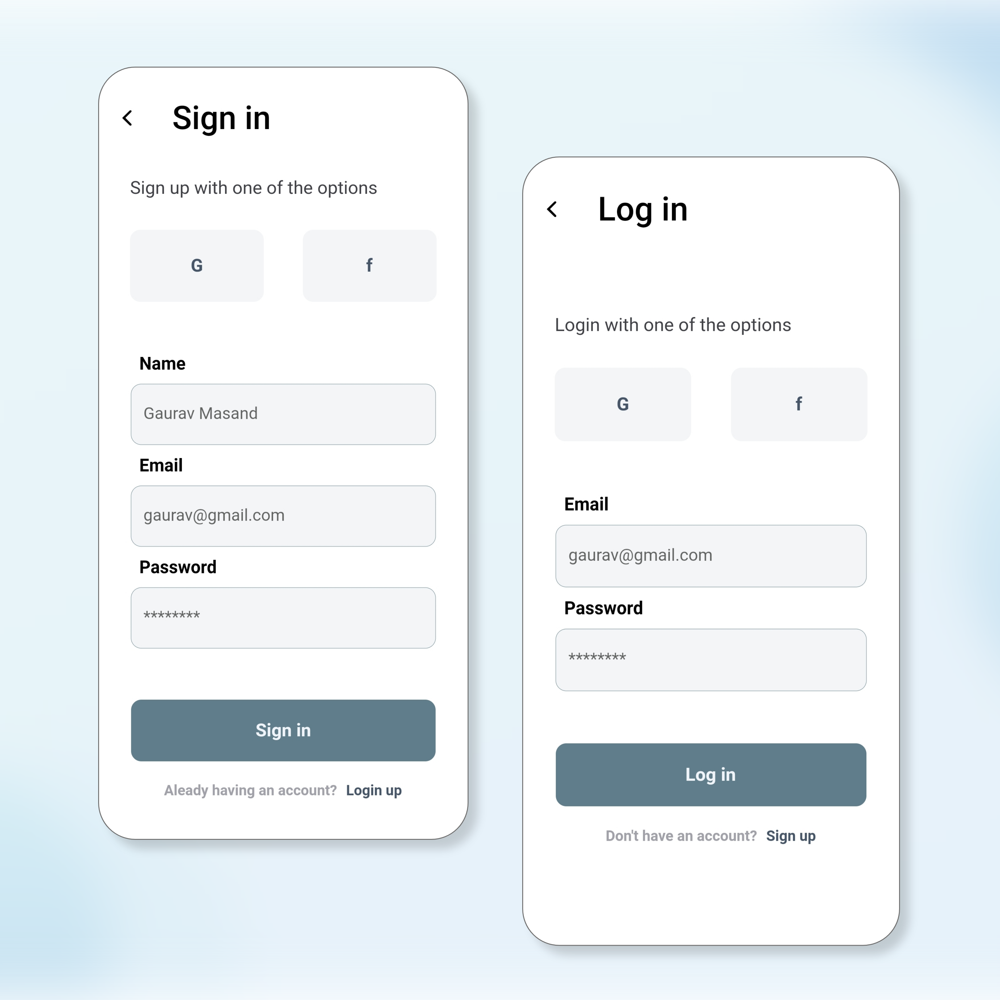

This project is created using <b>xampp server</b> (for phpmyadmin and mysql), <b>PHP</b> for API and as you know in <b>Flutter</b>.
Data is storing in the mysql of xampp server.

Screenshort of application:

